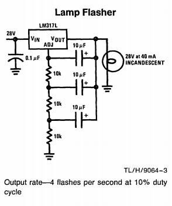
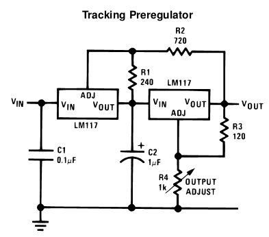

| [Back to Main Index](../../index.md) | [Back to Electronics Index](./index.md) |

## Linear Regulator Applications

Circuits where the primary component is a linear regulator.  
See my [Linear Regulators](./linear-reg-overview.md) page for a collection of datasheets for the most common parts.

- [LM317 Lamp Flasher](#lamp-flasher)
- [Tracking Pre-Regulator](#tracking-pre-regulator)
- [7800-Series Switch-Mode Regulator](#7800-switchmode-regulator)

### LM317L Lamp Flasher 
This one takes the prize for unorthodox use of a linear regulator. 

An over-current and over-temperature protected lamp flasher, from the first page
of [National's LM317L](./files/datasheets/LM317/LM317L_National_1982.pdf) 1982
datasheet:  

This application uses a linear regulator as an inverting amplifier! When ADJ
*exceeds* (Vout - 1.25V), OUT conducts to (Vin - dropout). When ADJ is *less
than* (OUT - 1.25V), the regulator "turns off" and OUT ceases to conduct. OUT is
then pulled to GND by the lamp's filament. The 3-stage RC network provides 180
degrees of phase shift to make the circuit oscillate. Fosc is *roughly*
predicted by the 3-stage-RC formula: `f = 1/(2*pi*R*C*sqrt(6))` - about 0.65Hz.
The schematic claims 4Hz. 

Practically, any adjustable - and maybe fixed - regulator could be used. I built
this circuit with a standard LM317 and it flashed at about 4.5Hz. **Note** the
lamp is used to pull OUT low when the regulator turns off. A suitable parallel
resistance must be used if the lamp is replaced by (e.g.) an LED. 

A similar circuit can be spotted on Page 8 of
[Linear's LT1038](./files/datasheets/LT1083/LT1083_LinearTech_1994.pdf) datasheet.
I have traced this circuit back to the LM317L entry in the 1982 National Linear
Databook. I cannot imagine where it has been used.  

### LM317 Tracking Pre-Regulator 
A simple way to spread dissipation and tolerate higher Vin-Vout without
sacrificing the regulator's internal protection circuitry. LM117s are shown
below, but almost any linear regulator will work. From
[National's LM317](./files/datasheets/LM317/LM317_National_1982.pdf) datasheet:  

R1 and R2 set the left-hand regulator to maintain `Vref*(1 + R2/R1)` *across the
right-hand regulator*. Thus the right-hand regulator's Vin *tracks* 5V above its
Vout. This is enough for good regulation and moderate dissipation. The dropout
of the overall design is the sum of the regulator dropouts.

According to National, an LM317 in a TO-3 or TO-220 package with **ideal
heatsinking** will tolerate Vin-Vout = 12V at max current before hitting
internal protection at approx 20W. Using this design with `R2 = 2K2`, two LM317s
could provide a max of 24V input-output difference at 1.5A AND provide full
protection. A dual-ganged potentiometer could be cleverly used to divide 
dissipation roughly equally across the regulators, for a 1.2V - 20V / 1.5A
adjustable supply.

### 7800-Series Switching Regulator <a name="7800-switchmode-regulator">
IC switching regulator designs trace their history to the introduction of
**linear** regulators in the late 1960s. National's AN1 from 1967 included a
switch-mode application of the LM100 (Widlar included a slightly simpler design
in AN2). A switcher based on Fairchild's uA723 appears in a 1968 app note. The
LM109 (the first monolithic 3-terminal regulator) was introduced two years later
but it apparently wasn't until Fairchild released the uA78XX series that a
3-terminal switcher design was published in [their 1973 datasheet](./files/datasheets/LM78XX/LM78XX_Fairchild_1973.pdf).

[Widlar's LM100 Switcher from National's AN1](./images/National_AN1_1967_Switching_Regulator.png "LM100 Switcher from National's AN1") 
[Simpler LM100 Switcher from National's AN2](./images/National_AN2_1967_Switching_Regulator.png "Simpler LM100 Switcher from National's AN2") 
[uA723 Switcher from a 1968 Fairchild App Note](./images/Fairchild_1968_uA723_Switching_Regulator.png "uA723 Switcher from a 1968 Fairchild App Note") 
[78XX Switcher from a 1973 Fairchild Datasheet](./images/Fairchild_1973_78XX_Switcher.png "78XX Switcher from a 1973 Fairchild Datasheet") 
[78XX Switcher Susanne Nell EDN 2002](./images/EDN_2002_Nell_78XX_Switcher.png "78XX Switcher by Susanne Nell EDN 2002") 

I built the circuit below, which is essentially Nell's design. It worked
surprisingly well with the 7805, 78M05, 7807, 7810, and 7812 regulators I had on
hand. Efficiency was similar across all parts. At 500mA load, efficiency was
55%-75%, increasing as Vin-Vout decreased. Output ripple was generally not good:
100mV-800mV, greater with larger Vin-Vout.

The name for this design is "hysteretic buck regulator" and its switching
frequency depends on line, load, temperature, and pretty-much-everything-else.
Modern switching regulator ICs are typically *not* hysteretic; they use PWM
control on a fixed switching frequency. Such modern ICs (some of which date back
to the 80s!) provide a more refined and controlled solution, and many require
only 3 external parts.

Even still, you probably don't have a TO-220 switching regulator in your junk
box, but you're pretty much guaranteed to have a 78XX and a PNP.
