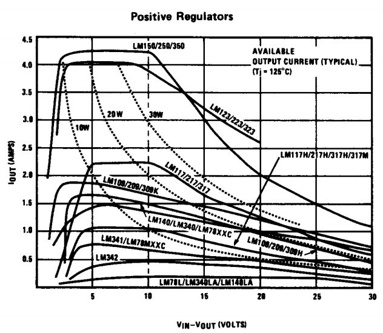
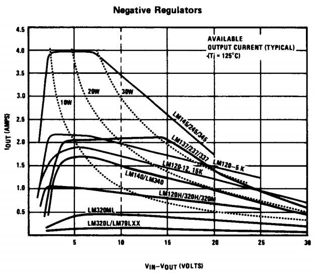

| [Back to Main Index](../../index.md) | [Back to Electronics Index](./index.md) |

## Linear Regulators
Below is a collection of the most common and enduring linear regulator ICs. The commercial-grade temp range part is listed.  

### Fixed Regulators
These are meant to produce a certain fixed output voltage, but clever designs can make them somewhat adjustable.

| Part           |Pos/Neg|   Input   |        Output          | Dropout |   Current  | Datasheets |
| -------------- | ----- | --------- | ---------------------- | ------- | ---------- | ---------- |
| LM320          |  Neg  |   -25V    |      -5/12/15          |  1.5V   |    1.5A    |[LM320_National_1982.pdf](./files/datasheets/LM320/LM320_National_1982.pdf) [LM320_National_1994.pdf](./files/datasheets/LM320/LM320_National_1994.pdf)|
| LM320(L/M)     |  Neg  |   -25V    |      -5/12/15          |  2.0V   | 0.1A/0.25A |[LM320L_National_1982.pdf](./files/datasheets/LM320/LM320L_National_1982.pdf)|
| LM340          |  Pos  |  35V/40V  |       5/12/15          |         |    1.0A    |[LM340_National_1972.pdf](./files/datasheets/LM340/LM340_National_1972.pdf) [LM340_National_1982.pdf](./files/datasheets/LM340/LM340_National_1982.pdf) [LM340_National_2006.pdf](./files/datasheets/LM340/LM340_National_2006.pdf)|
| LM2940         |  Pos  |  35V/40V  |    5/8/9/10/12/15      |  1.0V   |    1.0A    |[LM2940_National_1988.pdf](./files/datasheets/LM2940/LM2940_National_1988.pdf) [LM2940_National_2000.pdf](./files/datasheets/LM2940/LM2940_National_2000.pdf)|
| LM78XX         |  Neg  |  35V/40V  | 5/7/8/9/10/12/15/18/24 |         |    1.5A    |[LM78XX_Fairchild_1973.pdf](./files/datasheets/LM78XX/LM78XX_Fairchild_1973.pdf) [LM78XX_National_1980.pdf](./files/datasheets/LM78XX/LM78XX_National_1980.pdf) [LM78XX_National_1995.pdf](./files/datasheets/LM78XX/LM78XX_National_1995.pdf) [LM78XX_Fairchild_2001.pdf](./files/datasheets/LM78XX/LM78XX_Fairchild_2001.pdf)|
| LM78(L/M)XX    |  Neg  |  35V/40V  | 5/7/8/9/10/12/15/18/24 |         | 0.1A/0.25A |[LM78LXX_National_1980.pdf](./files/datasheets/LM78XX/LM78LXX_National_1980.pdf) [LM78MXX_National_1980.pdf](./files/datasheets/LM78XX/LM78MXX_National_1980.pdf)|
| LM79XX         |  Neg  | -35V/-40V |-5/7/8/9/10/12/15/18/24 |         |    1.0A    |[LM79XX_National_1980.pdf](./files/datasheets/LM79XX/LM79XX_National_1980.pdf) [LM79XX_National_1994.pdf](./files/datasheets/LM79XX/LM79XX_National_1994.pdf)|
| LM79(L/M)XX    |  Neg  | -35V/-40V |-5/7/8/9/10/12/15/18/24 |         | 0.1A/0.25A |[LM79LXXAC_National_1980.pdf](./files/datasheets/LM79XX/LM79LXXAC_National_1980.pdf) [LM79MXX_National_1980.pdf](./files/datasheets/LM79XX/LM79MXX_National_1980.pdf) [LM79MXX_National_2001.pdf](./files/datasheets/LM79XX/LM79MXX_National_2001.pdf)|

### Adjustable Regulators

| Part           |Pos/Neg|   In - Out   |  Dropout  |   Current  | Datasheets |
| -------------- | ----- | ------------ | --------- | ---------- | ---------- |
| LM723          |Pos/Neg|      -       |           |    0.2A    |            |
| LM317          |  Pos  |     40V      |    3.0V   |    1.5A    |            |
| LM317L         |  Pos  |     40V      |    2.0V   |    0.1A    |            |
| LM337          |  Neg  |    -40V      |   -3.0V   |    1.5A    |            |
| LM338          |  Pos  |     40V      |    3.0V   |    5.0A    |            |
| LM350          |  Pos  |     35V      |    2.5V   |    3.0A    |            |
| LM396          |  Pos  |     20V      |    2.5V   |     10A    |            |
| LT1038         |  Pos  |     35V      |    2.5V   |     10A    |            |
| LT1083,4,5     |  Pos  |     30V      |    1.0V   | 7.5A/5A/3A |            |

### Comparison
From [National's 1980 Voltage Regulator Handbook](./files/handbooks/National_1980_Voltage_Regulator_Handbook.pdf):  

  

  

## App Notes and Handbooks
These provide more extensive design guidance than individual device datasheets:
 - [National_Semiconductor_1980_Voltage_Regulator_Handbook.pdf](./files/handbooks/National_1980_Voltage_Regulator_Handbook.pdf)
 - [LM340_AN103_national.pdf](./files/handbooks/LM340_AN103_national.pdf) NatSemi App Note 103
 - [LM317_AN181_national.pdf](./files/handbooks/LM317_AN181_national.pdf) NatSemi App Note 181
 - [LM317_LB35_national.pdf](./files/handbooks/LM317_LB35_national.pdf) NatSemi Linear Brief 35
 - [LM317_LB46_national.pdf](./files/handbooks/LM317_LB46_national.pdf) NatSemi Linear Brief 46
 - [LM317_LB47_national.pdf](./files/handbooks/LM317_LB47_national.pdf) NatSemi Linear Brief 47
 - [AN1148_ti.pdf](./files/handbooks/AN1148_ti.pdf) TI App Note 1148

Covering all Linear ICs (Not just regulators):
 - [National_1972_Linear_Applications_Handbook.pdf](./files/handbooks/National_1972_Linear_Applications_Handbook.pdf)
 - [National_1973_Linear_Applications_Handbook.pdf](./files/handbooks/National_1973_Linear_Applications_Handbook.pdf)
 - [National_1994_Linear_Applications_Handbook.pdf](./files/handbooks/National_1994_Linear_Applications_Handbook.pdf)

## Design Guides
 - [VK5BR_1987_Power_Supply_Design.pdf](./files/handbooks/VK5BR_1987_Power_Supply_Design.pdf)
 - [SGS-Thomson_1995_Power_Supply_Design_Basics.pdf](./files/handbooks/SGSThomson_1995_Power_Supply_Design_Basics.pdf)
 - [Hammond_Rectifier_Design_Guide.pdf](./files/handbooks/Hammond_Rectifier_Design_Guide.pdf)
 - [Jim_Williams_1998_The_Art_and_Science_of_Analog_Circuit_Design.pdf](./files/handbooks/Jim_Williams_1998_The_Art_and_Science_of_Analog_Circuit_Design.pdf)

