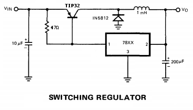

| [Back to Main Index](../../index.md) | [Back to Electronics Index](./index.md) |

## The Linear-Switcher Regulator
A.K.A the 7800-Series Switching Regulator

IC switching regulator designs trace their history to the introduction of
**linear** regulators in the late 1960s. National's AN1 from 1967 included a
switch-mode application of the LM100 (Widlar included a slightly simpler design
in AN2). A switcher based on Fairchild's uA723 appears in a 1968 app note. The
LM109 (the first monolithic 3-terminal regulator) was introduced two years later
but it apparently wasn't until Fairchild released the uA78XX series that a
3-terminal switcher design was published in [their 1973 datasheet](./files/datasheets/LM78XX/LM78XX_Fairchild_1973.pdf).

[Widlar's LM100 Switcher from National's AN1](./images/National_AN1_1967_Switching_Regulator.png "LM100 Switcher from National's AN1") 
[Simpler LM100 Switcher from National's AN2](./images/National_AN2_1967_Switching_Regulator.png "Simpler LM100 Switcher from National's AN2") 
[uA723 Switcher from a 1968 Fairchild App Note](./images/Fairchild_1968_uA723_Switching_Regulator.png "uA723 Switcher from a 1968 Fairchild App Note") 
[78XX Switcher from a 1973 Fairchild Datasheet](./images/Fairchild_1973_78XX_Switcher.png "78XX Switcher from a 1973 Fairchild Datasheet") 
[78XX Switcher Susanne Nell EDN 2002](./images/EDN_2002_Nell_78XX_Switcher.png "78XX Switcher by Susanne Nell EDN 2002") 

I built the circuit below, which is essentially Nell's design. It worked
surprisingly well with the 7805, 78M05, 7807, 7810, and 7812 regulators I had on
hand. Efficiency was similar across all parts. At 500mA load, efficiency was
55%-75%, increasing as Vin-Vout decreased. Output ripple was generally not good:
100mV-800mV, greater with larger Vin-Vout.

The name for this design is "hysteretic buck regulator" and its switching
frequency depends on line, load, temperature, and pretty-much-everything-else.
Modern switching regulator ICs are typically *not* hysteretic; they use PWM
control on a fixed switching frequency. Such modern ICs (some of which date back
to the 80s!) provide a more refined and controlled solution, and many require
only 3 external parts.
